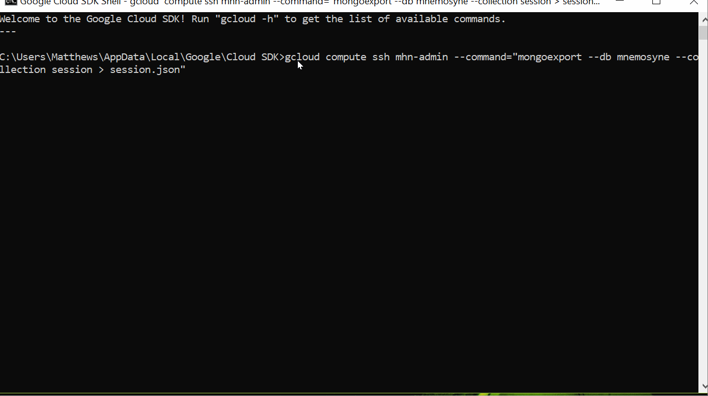
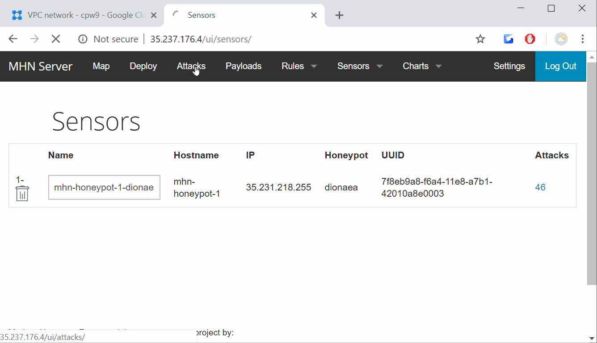

# Project 9 - Honeypot 

- Time spent: **20** hours spent in total

- Honeypot deployed:
  - Dionaea with HTTP
  
## Issues Encountered
- Had touble accessing the admin page
- Could not download json file
  
- Had trouble navigating Google Cloud Interface

## Summary of the Data Collected
- What we did
  - In this assignment, you will stand up a basic honeypot and demonstrate its effectiveness at detecting and/or collecting data about an attack
  - Done by creating two VMs using Google cloud, one as a honeypot and the other to monitor the attackers activity.
- Number of Attacks
  - 122
  
  
- Top 5 Attacker IPs:
  - 142.93.6.77 (6 attacks)
  - 202.168.151.72 (5 attacks)
  - 176.119.7.50 (5 attacks)
  - 104.248.19.20 (5 attacks)
  - 104.248.61.100 (5 attacks)
- Top 5 Attacked Ports:
  - 8088 (43 times)
  - 23 (12 times)
  - 3389 (6 times)
  - 3306 (5 times)
  - 445 (4 times)
## Unresolved Questions from Data
-No unresolved questions
